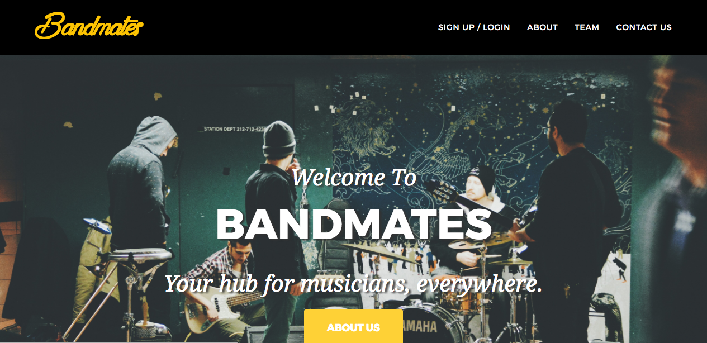
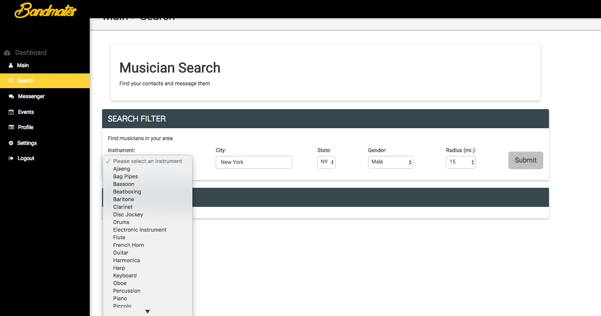
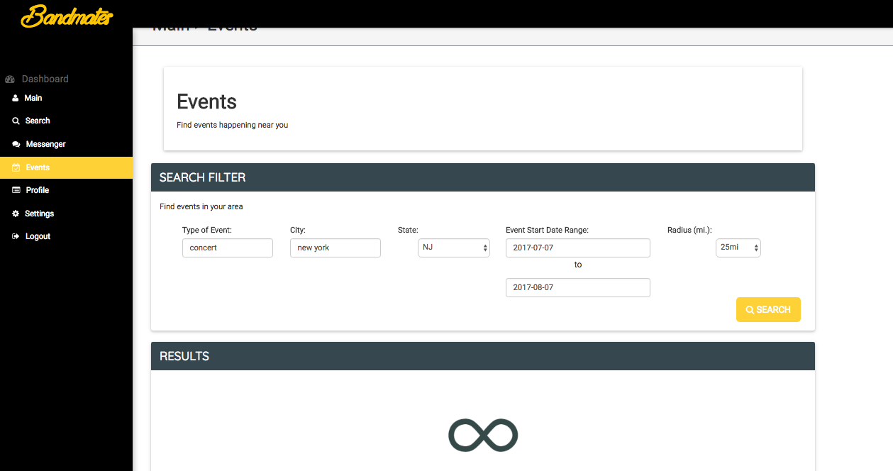

# Bandmates

## Description
Bandmates is a social platform for individuals seeking to make connections with other musicians,
showcase your music profile, and search for events. Whether you are a beginner searching to make
your first jump to make a first connection or an advanced music player that is searching for something
new. With a detailed profile and clear objective, Bandmates seeks to connect individuals as seamless as possible with a specific goal in mind without the awkward interactions you may find elsewhere. 
Home Page Example:

## How it works
By registering to our application, the user will be one step closer to joining a community of individuals
seeking similar goals. Users will search for individuals with their own custom criteria in order to find the like-minded individuals! 
Example: 
Our events page allows users to search for upcoming events, using Eventbright API, in your area to which brings users closer together in a more social setting.
Example: 

## Technologies Used
`HTML`, `Javascript`, `CSS`, `mysql`, `express`, `node`, `React`, `Sequalize ORM`